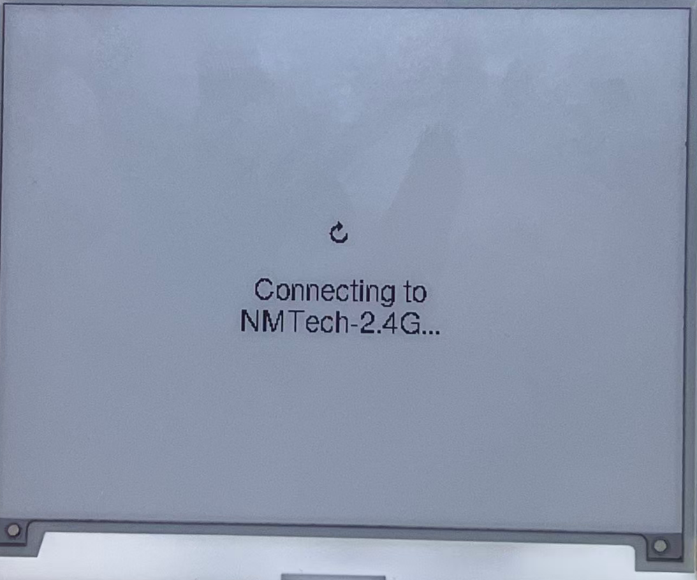
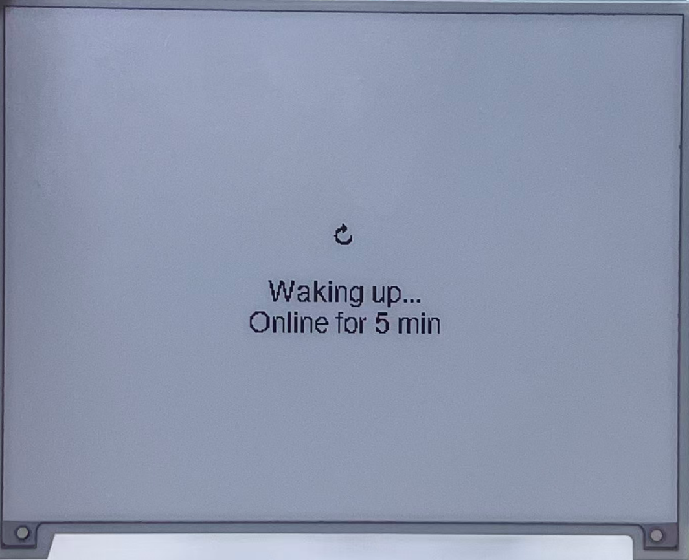
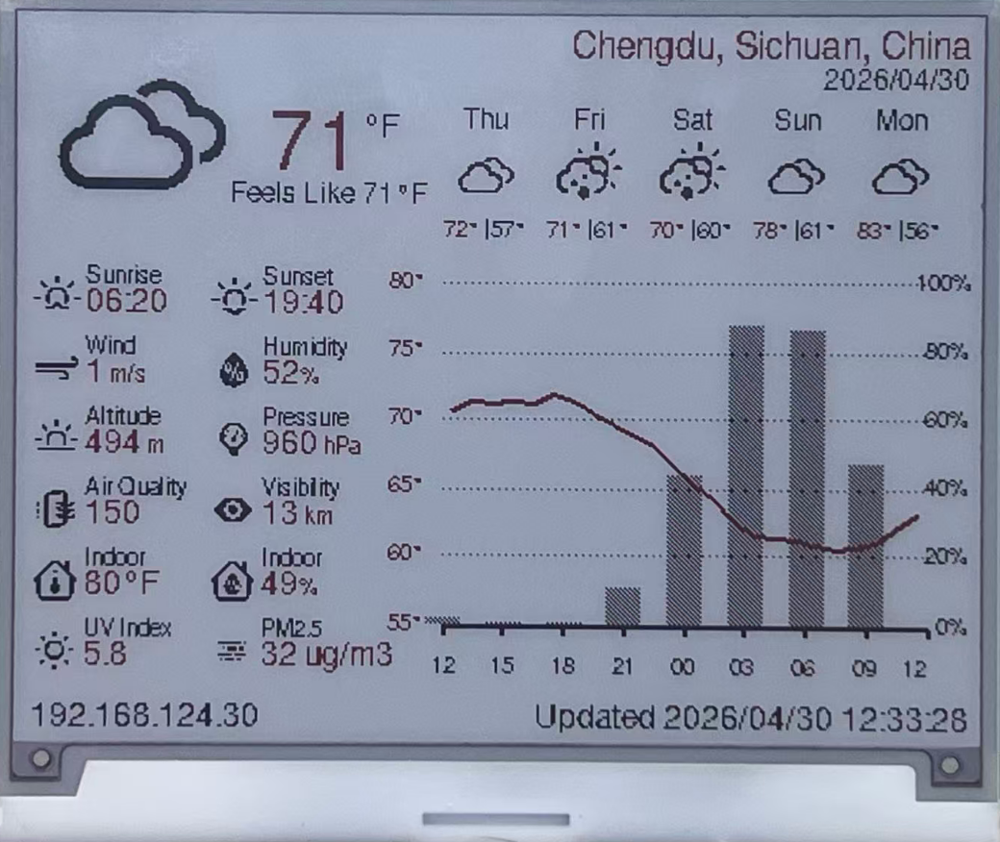
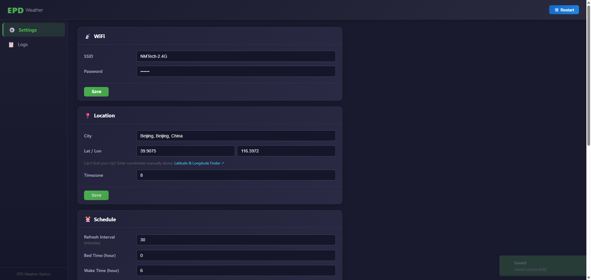
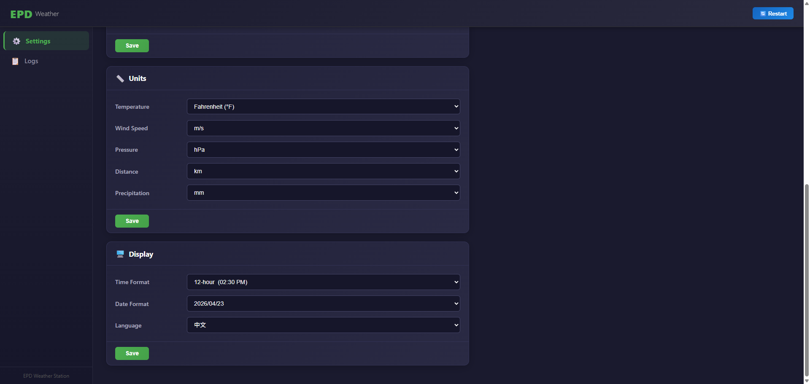

# ESP32 Dashboard

An e-paper dashboard running on ESP32. The current version features a fully functional weather station powered by the free [Open-Meteo](https://open-meteo.com/) API — **no API key required** — showing current conditions, a 5-day forecast, an hourly temperature / precipitation graph, air quality, and indoor sensor data.

This is just the beginning. The roadmap includes cryptocurrency prices, stock market data, local IoT device monitoring, and more — living up to the vision of a true **"Dashboard for anything"** on e-paper.

[](LICENSE)
[](https://platformio.org/)
[](https://www.arduino.cc/)

English | [简体中文](./README_cn.md)

---

## Preview

| Power-on splash | Waking up | Weather page |
|:-:|:-:|:-:|
|  |  |  |

| AP config mode | Web config portal (overview) | Web config portal (settings) |
|:-:|:-:|:-:|
|  |  |  |

---

## Features

- **Open-Meteo** weather + air quality — free, no API key, no account
- Current conditions: temperature, feels-like, wind, humidity, pressure, visibility, UV index
- 5-day daily forecast with WMO weather icons
- Hourly temperature trend line + precipitation probability bar chart (next 12 h)
- Indoor temperature & humidity from on-board AHT20 / BME280 sensor
- US AQI and PM2.5 concentration
- Deep sleep between updates (configurable interval, default 30 min)
- Bed-time / wake-time window — no display refresh during night hours
- Browser-based config portal (no app needed): WiFi, location, units, timezone, sleep interval
- AP config mode (long-press Boot button) — ESP32 becomes a hotspot for first-time setup
- Stay-awake web portal mode (short-press Boot button) — keep the portal alive for 5 min
- SNTP time synchronisation with configurable UTC offset
- 3-color (red/black/white) accent support on compatible panels
- Multilingual UI: `en_US`, `zh_CN`
- Configurable units: °C / °F, km/h / m/s / mph / kn, hPa / inHg / mmHg, km / mi, mm / in

---

## Supported Boards

| Environment | MCU | Display | Resolution | Colors | Sensor | Notes |
|---|---|---|---|---|---|---|
| `nm-display-420` | ESP32-S3 | 4.2″ EPD (GDEY042Z98) | 400 × 300 | Red / Black / White | AHT20 | |
| `dfrobot_firebeetle2_esp32e` / `firebeetle32` | ESP32 | 7.5″ EPD (GDEY075T7) | 800 × 480 | Black / White | BME280 | Planned — coming very soon, not yet tested |

---

## Pin Assignments

### NM Display 420 (ESP32-S3)

| Signal | GPIO | Notes |
|---|---|---|
| EPD CS | 3 | |
| EPD DC | 4 | |
| EPD RST | 5 | |
| EPD BUSY | 6 | |
| EPD SCK | 2 | |
| EPD MOSI | 1 | |
| EPD MISO | 10 | Unused (write-only display) |
| EPD PWR | 21 | Wired to 3.3 V, not switched |
| AHT20 SDA | 39 | |
| AHT20 SCL | 38 | |
| AHT20 CTL (power) | 40 | Drive HIGH before sensor access |
| Battery ADC | A0 | 100 kΩ + 100 kΩ voltage divider |
| Boot / wake button | IO0 | External pull-up, wakes deep sleep via EXT0 |
| AP config button | IO45 | External pull-up |

> The board carries an ES8311 audio codec on the same I²C bus. The firmware immediately puts it into suspend on boot to save ~3 mA.

---

## Quick Start

### 1. Install PlatformIO

Install [PlatformIO IDE](https://platformio.org/install/ide?install=vscode) (VS Code extension) or the CLI.

### 2. Clone & open

```bash
git clone https://github.com/your-repo/ESP32-Dashboard.git
cd ESP32-Dashboard
```

Open the folder in VS Code; PlatformIO will resolve all dependencies automatically.

### 3. Build & flash

Select the environment that matches your hardware:

```bash
# NM Display 420 (ESP32-S3, 4.2" tri-color EPD)
pio run -e nm-display-420 -t upload
```

The LittleFS filesystem image (web portal HTML) is built and uploaded automatically via `extra_script_fs.py`.

### 4. Test & build gates

Run the host-side pure C++ tests before firmware changes:

```bash
pio test -e native
```

Native tests require a host C/C++ compiler (`gcc` and `g++`) in PATH. The GitHub
Actions workflow runs them on Linux; local Windows runs need a compatible GCC
toolchain installed separately.

The release build gates are:

```bash
pio test -e native
pio run -e nm-display-420
pio run -e nm-display-420 -t buildfs
```

### 5. First-time configuration (AP mode)

1. Hold the **Boot button (IO0) for ≥ 2 seconds** on first power-on to enter **AP config mode**.
2. The display shows the hotspot name (`esp_dashboard_XXXXXX`) and the URL `192.168.4.1`.
3. Connect your phone or PC to that hotspot, open `http://192.168.4.1`.
4. Fill in WiFi credentials, latitude / longitude, city name, UTC offset, and preferred units; click **Save**.
5. The device restarts, connects to your home WiFi, fetches weather, and refreshes the display.

### 6. Subsequent access

Short-press the Boot button to keep the web portal alive for 5 minutes. The device stays on your home network; its IP address is shown at the bottom-left of the display. Open `http://<device-ip>` from any browser on the same network.

---

## Button Reference

| Action | Result |
|---|---|
| Short press Boot (IO0) | 5-minute stay-awake web portal |
| Long press Boot (IO0) ≥ 2 s | AP config mode (auto-exit after 10 min, then restart) |

---

## Configuration Options

All settings are stored in NVS flash and editable through the web portal:

| Setting | Default | Description |
|---|---|---|
| WiFi SSID | — | 2.4 GHz network name |
| WiFi Password | — | Network password |
| Latitude | `30.6667` | Location for weather queries |
| Longitude | `104.0667` | Location for weather queries |
| City name | `Chengdu, Sichuan, China` | Display label only |
| UTC offset | `8` | Hours from UTC (e.g. `8` = UTC+8) |
| Sleep interval | `30` min | Minutes between display refreshes |
| Bed time | `0` h | Hour to pause refreshing (24-h clock) |
| Wake time | `6` h | Hour to resume refreshing |
| Temperature unit | `C` | `C` / `F` |
| Wind speed unit | `kmh` | `kmh` / `ms` / `mph` / `kn` |
| Pressure unit | `hPa` | `hPa` / `inHg` / `mmHg` |
| Distance unit | `km` | `km` / `mi` |
| Precipitation unit | `mm` | `mm` / `in` |
| Language | `zh_CN` | `en_US` / `zh_CN` |

---

## Dependencies

### All environments

| Library | Version | Purpose |
|---|---|---|
| [ArduinoJson](https://github.com/bblanchon/ArduinoJson) | 7.4.3 | JSON parsing (Open-Meteo API responses) |
| [GxEPD2](https://github.com/ZinggJM/GxEPD2) | 1.6.8 | E-paper display driver |
| [AsyncTCP](https://github.com/me-no-dev/AsyncTCP) | latest | Async TCP foundation for web server |
| [ESPAsyncWebServer](https://github.com/me-no-dev/ESPAsyncWebServer) | latest | Web config portal backend |

### `nm-display-420` only

| Library | Version | Purpose |
|---|---|---|
| [Adafruit AHTX0](https://github.com/adafruit/Adafruit_AHTX0) | 2.0.5 | AHT20 temperature / humidity sensor |
| [Adafruit BusIO](https://github.com/adafruit/Adafruit_BusIO) | 1.17.4 | I²C / SPI abstraction |
| [Adafruit Unified Sensor](https://github.com/adafruit/Adafruit_Sensor) | 1.1.15 | Sensor abstraction layer |

---

## Project Structure

```
src/
├── main.cpp                  # Entry point — calls DashboardApp::run()
├── app/
│   ├── dashboardApp.cpp/h    # Top-level wake-cycle controller
│   ├── config/               # NVS config load / save, settings struct
│   ├── weather/              # Open-Meteo HTTP fetch + JSON parse
│   ├── wifi/                 # WiFi connect + SNTP time sync
│   ├── web/                  # ESPAsyncWebServer config portal (REST API)
│   └── locale/               # en_US / zh_CN locale strings
├── bsp/
│   ├── IBoard.h              # Hardware abstraction interface
│   ├── nm_display_420/       # ESP32-S3 + 4.2" tri-color EPD BSP
│   ├── firebeetle2_esp32e/   # FireBeetle 2 ESP32-E + BME280 BSP
│   └── firebeetle32/         # FireBeetle ESP32 + BME280 BSP
├── drivers/
│   ├── sensor/               # ISensor interface + AHT20 driver
│   └── audio/                # ES8311 codec suspend helper
├── ui/
│   ├── layouts/
│   │   ├── epd_400x300/      # 4.2" tri-color page layout
│   │   └── epd_800x480/      # 7.5" BW page layout
│   └── pages/                # PageWeatherBase, PageLoading, PageError
└── assets/
    ├── fonts/                # FreeSans bitmap fonts (4 pt – 48 pt)
    └── icons/                # Weather icons (16×16 to 96×96)
```

---

## Wake-cycle Flow

```
Power-on / timer wakeup
        │
        ▼
  _detectWakeup()
  ┌─────────────────────────────────┐
  │ Long press (≥2 s) → AP mode    │
  │ Short press       → stay-awake │
  │ Timer / cold boot → normal     │
  └─────────────────────────────────┘
        │
        ▼
  _initHardware()      EPD init + sensor init
        │
        ├─── AP mode ──► SoftAP + web portal → restart after 10 min
        │
        ▼
  _showLoadingPage()   (cold boot / button wake only)
        │
        ▼
  _connectAndSync()    WiFi connect + SNTP time sync
        │ failure → retry up to 3× then show error page → sleep
        ▼
  _fetchData()         Open-Meteo weather + AQI HTTP requests
        │ failure → retry up to 3× then show error page → sleep
        ▼
  _renderWeather()     EPD page-based draw loop
        │
        ▼  (stay-awake: run web portal for 5 min)
  WiFi disconnect → EPD hibernate → deep sleep (N minutes)
```

---

## Porting to a New Board

1. **Create** `src/bsp/<board_name>/config.h` — define `DISP_WIDTH`, `DISP_HEIGHT`, and all `PIN_*` constants.

2. **Create** `src/bsp/<board_name>/Board.cpp` — implement `IBoard`:

   | Method | Requirement |
   |---|---|
   | `init()` | Serial, power rails, peripherals |
   | `epd()` | Return `IEpdDriver&` wrapping GxEPD2 |
   | `gfx()` | Return `Adafruit_GFX&` from GxEPD2 |
   | `colorAccent()` / `hasAccentColor()` | Red for 3-color panels; black / false for BW |
   | `getTempSensor()` | Return `ISensor*` or `nullptr` |
   | `readBatteryMv()` | ADC reading converted to millivolts |
   | `deepSleep(us)` | Configure wakeup, call `esp_deep_sleep_start()` |
   | `bootButtonPin()` / `apButtonPin()` | GPIO numbers |

3. **Add a UI layout** under `src/ui/layouts/epd_NNNxNNN/` if the resolution differs from existing ones. Subclass `PageWeatherBase` and implement `_drawCurrentConditions()`, `_drawForecast()`, and `_drawStatusBar()`.

4. **Register** a PlatformIO environment in `platformio.ini`:

   ```ini
   [env:my_board]
   board = <pio_board_id>
   build_src_filter =
       +<*>
       -<bsp/>        +<bsp/my_board/>
       -<ui/layouts/> +<ui/layouts/epd_NNNxNNN/>
   build_flags =
       ${env.build_flags}
       -DUI_LAYOUT_EPD_NNNxNNN
   lib_deps =
       ${env.lib_deps}
       <any extra sensor library>
   ```

---

## Acknowledgements

- [Open-Meteo](https://open-meteo.com/) — free, open-source weather API
- [GxEPD2](https://github.com/ZinggJM/GxEPD2) — e-paper display library
- [ArduinoJson](https://arduinojson.org/) — JSON library for Arduino / ESP32
- [ESPAsyncWebServer](https://github.com/me-no-dev/ESPAsyncWebServer) — async HTTP server
- [Adafruit](https://github.com/adafruit) — sensor and GFX libraries

